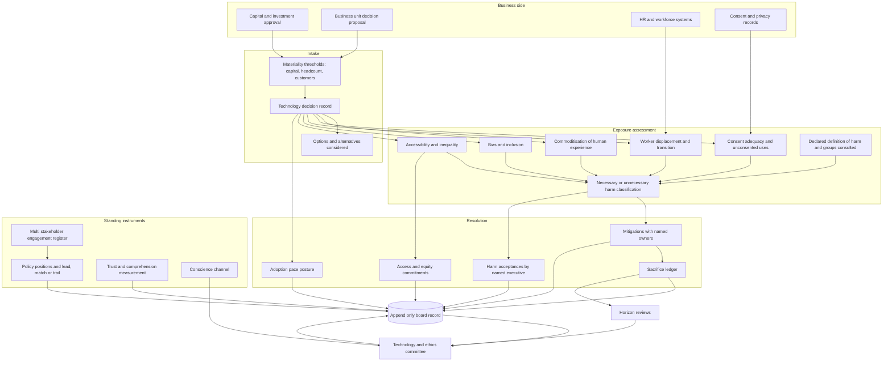

# Bellwether

**Source:** `ai-in-ethics/deloitte-ethics-in-the-age-of-disruption/`
**Domain:** `ai-ethics`
**One-liner:** A board-level radar for disruptive technology decisions that scores each decision's exposure across the harms that land outside the company — human-experience commoditisation, consent adequacy, worker displacement, bias and inclusion, accessibility and inequality — and records the short-term sacrifice the board accepted, so leadership can hold a defensible position ahead of regulation rather than after it.
**Wedge:** The technology and ethics committee of an employer with 5,000 or more staff — retail banking, insurance, telecommunications, health services — at the point of its first material ai-driven operating-model change, because that is when displacement, consent adequacy and inclusion exposure arrive at once and the board discovers it has no record of the trade-off it approved.
**Positioning:** Governance of technology *decisions*, not technology systems. Model assurance answers a supervisor's question about a deployed model and a delivery gate answers a product team's question about a feature; Bellwether answers the question the source says only business can answer in time — what harms will this decision impose on people who are not our counterparties, which of those harms are avoidable, whose definition of harm are we using, and what were we willing to give up to avoid them. Its organising claim comes straight from the paper: policy and legislation take time, so "government can only react to new technologies and their use, not provide leadership," which leaves the leading position vacant and the board holding it whether or not it has documented doing so.

## Market research synthesis

### Thesis from source

The paper's central structural argument is about timing, not morality. Technology-driven disruption is happening at an unprecedented pace, and "the pace of technology-driven change is so fast that policy-makers and regulators find themselves perpetually playing catch-up. Changes to policy, regulation, and legislation take time. As a result, government can only react to new technologies and their use, not provide leadership." Business, by contrast, sits at the forefront: companies are both the innovators creating the technologies that change the world and "the relentless competitors that use these same technologies to eke out every competitive advantage." The conclusion the paper draws is that business "can—and, many would argue, must—step up," and that leaders are "ideally positioned to ensure the technologies they develop and use function ethically, inclusively, and equitably." That is a governance assignment, and it lands on boards.

The definitional groundwork is what makes the assessment design possible. Ethics is framed as the pursuit of good actions based on good decision-making — "decisions and actions that lead to the least possible amount of unnecessary harm or suffering" — and the paper is unusually honest that the terms are contested. What "good" means is highly subjective; even "unnecessary harm" is subjective, "shaped by various influences, including geographical, political, cultural, and personal biases"; humans "are unable to objectively predict which choices are 'best'"; and making a choice "always entails the risk we'll choose poorly." Ethical decisions must simultaneously account for historical precedent and predict how the choice will play out. Business ethics specifically "requires boards and leadership teams to ensure the success of their businesses in a way that limits harmful consequences for the organization itself as well as its employees and the society of which they're a part" — three named spheres, in that order — and leaders "must consider all of the consequences and impacts their behaviour might have on every sphere of ethical concern." Critically, the paper says ethical decision-making "can require short-term sacrifice for long-term, sustainable success," while insisting that leaders need not "only choose impossibly perfect options that never cause unintended harm"; ethical decision-making "must negotiate risk, reward, and safety." Two design consequences follow: harm must be classified as necessary or unnecessary rather than merely tallied, and the sacrifice accepted must be recorded, because an unrecorded sacrifice is indistinguishable from a decision nobody made.

The paper then names five exposure domains, and each carries evidence a radar can be calibrated against. On the **commoditisation of human experience**, it estimates humans will have generated 40 zettabytes — about 37 trillion gigabytes — by 2020, much of it by social media users, and concludes that "human experience has become the raw ore for a new generation of organizations to mine for profit," with the Facebook–Cambridge Analytica scandal as the demonstration that business, government and society "continue to struggle with the ethics of the use and sale of personal data." On **consent between humans and machines**, it notes that companies "often buy and use data in ways that aren't addressed in user agreements—ways customers may not have expressly consented to," that customers have a right to know how their data is used, and — the finding that reframes consent as a comprehension problem rather than a disclosure problem — that in one experiment 98 percent of respondents unwittingly agreed to give up their first-born child in the terms of service of a fictitious social networking site. It asks what informed consent can mean "in relation to technologies that often operate with little to no transparency," observes that businesses need not wait for legislative reform, and points to enshrining privacy principles in corporate social responsibility policy and to Microsoft upgrading its engineering systems to meet data protection standards as examples of moving first. On **worker displacement and transitions**, it frames the challenge as balancing "the best interests of the business, the employees, and the wider community and society," notes that AI creates jobs requiring highly specialised skills even as it replaces others, and reports that "much of the literature suggests that incremental adoption of advanced technologies is a more responsible approach, because it permits closer supervision by human agents" — implemented in ways "entirely transparent to employees, business partners, and customers." It cites France's national AI strategy as resembling an "ethics of care" that maximises profit through stronger relationships between employers, employees and wider society, with Macron's framing that disruption "can destroy many jobs in some sectors and create a need to retrain people. But AI could also be one of the solutions to better train these people."

On **bias and inclusion** the paper is concrete about who is harmed and how. Since "AI is just an extension of our existing culture," designers' conscious and unconscious biases become embedded in algorithms; an ai-based hiring process can screen out parts of the population where job qualifications are based on the characteristics of the traditionally dominant demographic group, which "typically disproportionately affects traditionally under-represented groups such as visible minorities, women, Indigenous peoples, members of the LGBTQ+ community, and disabled people"; and because the bias is built in, "this discrimination takes place automatically, without human input." Remedies canvassed include deliberately inclusive systems such as designing them to ignore demographic information about candidates, inclusive design practices, development teams that are more diverse and better reflect the end user, and emotional AI systems that confirm and correct their understanding of user intent. The accountability question is left open and quoted as such: some argue humans should be held legally accountable for technologies that discriminate, but "how would we identify who—or what—to hold accountable?" On **accessibility and inequality**, it observes that the benefits of new technology "are rarely shared equitably throughout society" and often leave marginalised groups further behind, cites UNCTAD that "most of the gains from productivity growth may not be widely shared; rather, they will likely benefit capital owners and a few highly skilled workers with strong cognitive, adaptive and creative skills," cites OECD evidence of a widening productivity gap between frontier and lagging firms linked to increasing inequality of income and opportunity, argues for a shift from the linear study–work–retire path to non-linear lifelong learning, and points to business's own levers: discounts to students, teachers and schools, and connectivity initiatives such as Project Loon and Amazon's browser for emerging markets, alongside Canada's Accessible Technology Program.

The closing argument is collaborative governance: effective governance of emerging technologies "requires all relevant stakeholders—industry, consumers, businesses, governments, academia, and society—to work together in a collaborative, decentralized way," because "governments can't do it alone, nor should they." It offers the European Union's Responsible Research and Innovation process, in which all stakeholders including business participate in decision-making about technologies, as the working model, and assigns roles precisely: "Technology experts can anticipate potential challenges; businesses can interpret the impacts on customers or clients; and governments can address potential problems affecting society more widely." Its stated purpose for that dialogue is prevention — new rules and guidance on privacy, transparency, inclusivity, accessibility and inequality, "mitigating these issues before they become problems." A company that intends to lead therefore needs an engagement record that shows what it heard and what it changed, not a stakeholder mailing list.

### Buyer & economic model

- **Primary buyer:** the Chief Corporate Affairs or Chief Sustainability Officer who staffs the board's technology and ethics committee, purchasing jointly with the Company Secretary who owns the durability of the board record. The economic sponsor is the committee chair, whose personal exposure is the reason the budget exists.
- **Users:** the committee chair and non-executive members (per meeting cycle), the corporate affairs team operating the radar (weekly), business unit leaders submitting technology decisions for review (per decision), the HR transition lead and employee or works council representative (per displacement plan), the privacy and consent lead supplying comprehension evidence (quarterly), the public policy and government relations team maintaining the company's advocated positions (continuous), internal audit and the Company Secretary reading the record (periodic), and a conscience-channel intake function handling reports of commercial pressure overriding ethical judgement.
- **Budget owner / value metric:** the corporate governance and corporate affairs budget, with a contribution from enterprise risk. The primary value metric is the proportion of material technology decisions reaching the board with a completed harm assessment and a named position before commitment rather than after; the secondary metrics are stakeholder trust movement in the groups the decisions affect, the share of harms classified as unnecessary that were actually designed out, and the ratio of recorded sacrifices whose long-term benefit was subsequently evidenced.
- **Competing status quo:** a board paper written by the sponsoring business unit, an ESG or sustainability report assembled annually from whatever data exists, a reputational risk line in the enterprise risk register with no decision-level granularity, a separate whistleblowing hotline whose reports never reach the technology decision that provoked them, and a public policy team advocating positions the board has never formally adopted. The structural failure is that the company's ethical position is reconstructed after an incident from documents that were written for other purposes.

### Domain constraints

- **Regulatory / trust / safety:** the harms in scope are largely *not* the subject of existing enforceable rules — that is the paper's whole premise — so the product cannot lean on a compliance checklist and must instead make a contestable judgement defensible: whose definition of harm, which bias lens, what was foreseeable at the time. Where rules do exist, notably privacy and employment consultation duties, the platform must not let a self-set ethical position be mistaken for legal clearance. Board records attract discovery, so a candid harm assessment must be written in the knowledge that it may be read adversarially, which pushes toward recording reasoning and alternatives considered rather than conclusions alone. Consultation with employee representatives is a legal obligation in several jurisdictions and cannot be replaced by a survey.
- **Data sensitivity:** conscience-channel reports name individuals and allege pressure by named executives, and must be routable to a committee without passing through the accused reporting line. Employee displacement plans identify specific roles and locations before announcement and are market-sensitive as well as personally sensitive. Trust measurement across under-represented groups requires demographic data whose collection is itself restricted and, when done badly, reproduces the harm being measured. Draft board papers on unannounced technology decisions are inside information. The platform therefore needs compartmented access by committee, business unit and channel rather than a single confidentiality tier.
- **Change-management realities:** boards meet on a cycle, and technology decisions do not wait for it — so the product must support a between-meetings position with a delegated authority and a ratification obligation, or it will simply be bypassed. Business unit leaders under commercial pressure will not volunteer harm assessments, so the trigger must be a threshold rule tied to the capital, headcount or customer-population size of the decision. The paper's own honesty about subjectivity is an adoption asset: executives will engage with a tool that asks them to state whose definition of harm they used far more readily than with one that claims to compute an ethical score. And the long-term benefit that justifies a short-term sacrifice may take years to appear, which means the sacrifice ledger only earns its keep if it survives leadership turnover.

## Business requirements

- BR-1: Every technology decision above a defined materiality threshold — measured by capital committed, employees whose work changes, or size of the customer population affected — must reach the board committee with a completed harm assessment before commitment, and a decision taken without one must be reported to the committee as a control failure naming the approver.
- BR-2: Each harm identified must be classified as necessary or unnecessary, where unnecessary means avoidable by an available design, sequencing or commercial choice, and every unnecessary harm must have either a mitigation with a named owner or an explicit, recorded acceptance — because the source defines ethics as minimising *unnecessary* harm rather than all harm.
- BR-3: Every harm assessment must state whose definition of harm was applied and which stakeholder groups were consulted in forming it, so that the geographical, political, cultural and personal bias in the judgement is visible on the face of the record rather than hidden inside it.
- BR-4: Exposure must be maintained continuously across the five named domains — commoditisation of human experience, consent and privacy, worker displacement, bias and inclusion, accessibility and inequality — for each stakeholder group, so that the committee governs a moving position rather than a set of closed decisions.
- BR-5: Where the board accepts a short-term commercial sacrifice to avoid a harm, the sacrifice must be quantified and recorded with the long-term benefit it was expected to secure, and the platform must return to that record at a defined horizon and report whether the benefit materialised.
- BR-6: Consent adequacy must be measured by evidence that affected people actually understood what they agreed to, not by the existence of a signed agreement, and any data use not addressed in the user agreement under which the data was collected must be flagged as an unconsented use requiring a decision.
- BR-7: Any decision that materially changes how employees work must carry a transition plan covering roles affected, retraining or redeployment provision on a non-linear rather than a study-work-retire assumption, and evidence of consultation with employee representatives before board approval.
- BR-8: Each decision must record its adoption pace — incremental or full-scale — with the reasoning, and where full-scale adoption is chosen the platform must record what closer human supervision was forgone and what compensating oversight replaces it, together with the commitments made to employees, business partners and customers on transparency.
- BR-9: Distributional effects must be assessed for each decision against the groups the source identifies as most often left behind, and where benefits accrue disproportionately to already-advantaged groups the platform must record either a corrective access commitment with a delivery date or a reasoned decision not to make one.
- BR-10: The company must hold a stated position on each exposure domain, must record whether that position leads, matches or trails the emerging regulatory consensus, and must have a named owner accountable for advocating it in multi-stakeholder forums — the source's argument that business must lead is only operative if the leading position is written down and owned.
- BR-11: Every multi-stakeholder engagement must record what the company heard and what changed as a result, and engagements that produced no change must be visible as such, so that consultation is evidenced by its effect rather than by its occurrence.
- BR-12: There must be a channel by which any employee can report that commercial pressure is overriding ethical judgement on a specific technology decision, routed to the committee without passing through the reporting line named in the report, with a recorded outcome and protection for the reporter.
- BR-13: Stakeholder trust must be measured per group on a repeating cycle and reported alongside the decisions affecting that group, so that trust erosion is attributable to decisions rather than treated as ambient sentiment.

## User stories

Canonical user stories live in sibling [USER_STORIES.md](USER_STORIES.md).

## System design

### Overview

Bellwether treats the technology *decision* as the governed object. A decision enters when it crosses a materiality threshold — capital committed, employees whose work changes, or customers affected — and is assessed across five exposure domains taken from the source: commoditisation of human experience, consent and privacy, worker displacement, bias and inclusion, and accessibility and inequality. For each domain the assessment names the affected stakeholder groups, itemises harms, and classifies each harm as necessary or unnecessary, where unnecessary means avoidable by an available design, sequencing or commercial choice. It also records whose definition of harm was applied and which groups were consulted, because the source is explicit that both "good" and "unnecessary harm" are shaped by geographical, political, cultural and personal bias. Unnecessary harms then resolve one of two ways: a mitigation with a named owner, or a recorded acceptance with an accepting executive. Where a mitigation costs the company revenue, margin or speed, that cost is written into a sacrifice ledger together with the long-term benefit it was expected to secure and a horizon date at which the platform will ask whether the benefit appeared. Around the decision sit the standing instruments: displacement plans with consultation evidence, adoption-pace postures with their compensating oversight, access and equity commitments with delivery dates, consent-comprehension measurement rather than consent capture, per-domain policy positions with a lead-or-trail assessment against emerging regulation and a named advocate, a multi-stakeholder engagement register recording what changed, a conscience channel that bypasses the implicated reporting line, and per-group trust measurement reported against the decisions affecting that group. The board record is append-only and reconstructable as at any date.

### Actors & boundaries

- **Actors:** the board technology and ethics committee and its chair, the Chief Corporate Affairs or Sustainability Officer as radar operator, business unit leaders proposing decisions, the HR transition lead, employee and works council representatives, the privacy and consent lead, the public policy and government relations lead, the conscience-channel intake officer, internal audit and the Company Secretary. Outside the boundary but represented in the data: customers, communities, under-represented groups, regulators, academia and civil society participants in engagement.
- **Trust boundary:** Bellwether holds decisions, judgements and commitments — never the operating systems those decisions concern. Draft decision records for unannounced changes are inside information and access-scoped accordingly. Conscience-channel reports enter a separate compartment routed to the committee chair and the intake officer only, structurally excluded from the reporting line named in the report. Displacement plans are held under pre-announcement restriction. Demographic data supporting distributional and trust measurement is held in aggregate at the decision record, with any individual-level material remaining in the source measurement system. Board decision records, positions and dissent are append-only; a position can be superseded, never rewritten.
- **Human-in-the-loop points:** the materiality determination that pulls a decision into scope; the necessary-versus-unnecessary classification of each harm and its adjudication when contested; mitigation ownership acceptance; harm acceptance signed by a named executive; adoption-pace choice; employee consultation sign-off before board approval; the committee's decision and any recorded dissent; delegated between-meetings authority and its ratification; the horizon review of each sacrifice; and the outcome decision on every conscience-channel report.

### Core capabilities

1. **Decision intake and materiality** — threshold rules on capital, headcount impact and customer population; automatic escalation when a decision proceeds without assessment.
2. **Harm assessment** — per-domain itemisation, necessary versus unnecessary classification, contested-classification adjudication, alternatives considered, and the declared definition-of-harm basis and consulted groups.
3. **Exposure radar** — continuous scoring across the five domains by stakeholder group, with movement and drivers rather than point-in-time scores.
4. **Sacrifice ledger** — quantified short-term cost accepted, expected long-term benefit, horizon date and evidenced outcome at horizon.
5. **Consent adequacy measurement** — comprehension evidence per data use, register of uses not addressed by the agreement under which data was collected, and decisions on those uses.
6. **Displacement and transition** — roles affected, retraining and redeployment provision on a non-linear career assumption, consultation evidence and pre-approval gating.
7. **Adoption pace posture** — incremental or full-scale with reasoning, oversight forgone, compensating oversight, and transparency commitments to employees, partners and customers.
8. **Distributional and access commitments** — benefit incidence against groups most often left behind, corrective commitments with delivery dates, and reasoned decisions not to commit.
9. **Policy posture** — the company's stated position per domain, lead-match-trail assessment against emerging regulation, and named advocate.
10. **Multi-stakeholder engagement register** — engagements by stakeholder category, what was heard, and what changed, with no-change engagements visible.
11. **Conscience channel** — intake, compartmented routing that bypasses the implicated line, outcome recording and reporter-protection evidence.
12. **Trust measurement** — per-group trust and consent-comprehension indices on a repeating cycle, attributed to the decisions affecting each group.
13. **Board record** — append-only decisions, positions, dissent, delegated authorities and ratifications, reconstructable as at any date.

### Conceptual data

- **Primary entities:** TechnologyDecision, DecisionOption, MaterialityAssessment, HarmAssessment, HarmItem, DefinitionOfHarmBasis, StakeholderGroup, ExposureScore, Mitigation, HarmAcceptance, SacrificeLedgerEntry, ConsentAdequacyMeasure, UnconsentedUse, DisplacementPlan, ConsultationRecord, AdoptionPacePosture, DistributionalAssessment, AccessCommitment, PolicyPosition, RegulatoryLeadLagAssessment, StakeholderEngagement, EngagementOutcome, ConscienceReport, TrustMeasure, BoardDecisionRecord, DissentRecord, DelegatedAuthority, HorizonReview.
- **Critical events:** decision registered, materiality threshold crossed, decision proceeded without assessment, harm itemised, harm classification contested and adjudicated, mitigation assigned and accepted, harm accepted by named executive, sacrifice recorded, horizon reached and benefit evidenced or not, unconsented use identified and decided, consultation completed, displacement plan approved, adoption pace chosen, access commitment made and delivered or missed, policy position adopted or superseded, lead-match-trail reassessed, engagement held with or without resulting change, conscience report received, routed, outcome recorded, trust measure captured, board decision taken, dissent recorded, delegated decision ratified or overturned.
- **Retention / audit needs:** board decision records, positions, dissent and delegated authorities retained append-only for the statutory board record period and beyond, reconstructable against the materiality and threshold rules in force at the time. Harm assessments retained with their alternatives-considered material intact, since the defensibility of a past decision rests on what was foreseeable then. Conscience reports retained under separate access control for the whistleblowing retention period with reporter identity segregated from the substantive record. Displacement plans held under pre-announcement restriction until the announcement date, then retained with the decision. Trust and distributional measurement retained as aggregates with methodology and sample recorded; individual-level demographic data not retained in the platform. Access commitments retained until delivery is evidenced or the commitment is formally withdrawn.

### Integrations (conceptual)

- **Systems of record:** the board and committee management system for agendas, minutes and delegated authorities; the investment and capital approval system supplying the decisions and their committed amounts; the HR system for affected role counts, reporting lines and consultation bodies; the consent management platform and privacy records of processing for data uses and their agreements; the customer data platform for affected population sizing; the whistleblowing case system where one already exists; and the public policy and government relations tracker.
- **Upstream signals:** regulatory and legislative pipeline monitoring per domain, industry standard-setting and multi-stakeholder forum outputs, customer complaint and ombudsman themes, employee engagement survey items on automation and job security, brand and trust survey waves, media and civil society commentary, academic findings made accessible to business as the source recommends, and accessibility and digital-inclusion data for the markets served.
- **Downstream actions:** committee agenda items and board papers generated from decision records, holds placed on capital release where a material decision lacks an assessment, mitigation tasks assigned to named owners in the enterprise work system, consultation requests issued to works councils and employee representatives, access commitments tracked into delivery plans, advocated positions published to the public policy team's briefing pack, horizon reviews scheduled years ahead, and conscience-report outcomes returned to the reporter through the protected channel.

### High-level architecture

Decisions flow in on a materiality trigger, are assessed across five exposure domains, and resolve into mitigations, acceptances or sacrifices recorded in an append-only board record. Standing instruments — policy postures, engagements, trust measurement, the conscience channel — feed the same record continuously, so the committee reads a moving position rather than a set of closed items.

### Success metrics

- **Leading:** share of material technology decisions reaching the committee with a completed harm assessment before commitment; count of decisions that proceeded without one; proportion of identified unnecessary harms with a named mitigation owner versus a recorded acceptance; number of harm classifications contested and adjudicated, as a signal that the necessary-or-unnecessary test is being argued rather than rubber-stamped; consent-comprehension score by data use and count of open unconsented uses; consultations completed before board approval where employee work changes; engagements recording a resulting change as a share of all engagements; conscience reports received, median days to recorded outcome, and share with reporter protection evidenced; exposure movement per domain per stakeholder group.
- **Lagging:** trust index movement in the stakeholder groups affected by the period's decisions; share of recorded sacrifices whose expected long-term benefit was evidenced at horizon; distributional outcomes for the groups the source identifies as most often left behind, measured against access commitments delivered on time; incidents, regulatory interventions or public controversies in a domain where the company had recorded a leading position, which tests whether the position was real; adverse outcomes arising from harms that a prior assessment had classified as necessary, which tests the quality of the classification; retention and redeployment outcomes for displaced roles against the transition plan; and the durability of positions across leadership change, measured as the share of standing positions reaffirmed rather than silently lapsed.

## OpenAPI skeleton

Canonical HTTP surface lives in sibling [openapi.yaml](openapi.yaml). Summary:

- **Base path:** `/v1/...`
- **Auth:** `X-API-Key` for machine integration from capital approval, HR, consent, survey and regulatory-monitoring systems; Bearer JWT for committee, operator, business unit, HR and audit users, with the conscience channel scoped so that intake and committee roles alone can read a report.
- **Resource groups:** Decisions, Harm Assessment, Exposure, Sacrifice Ledger, Consent Adequacy, Displacement, Access & Equity, Policy Posture, Engagement, Conscience Channel, Trust, Board Record.
