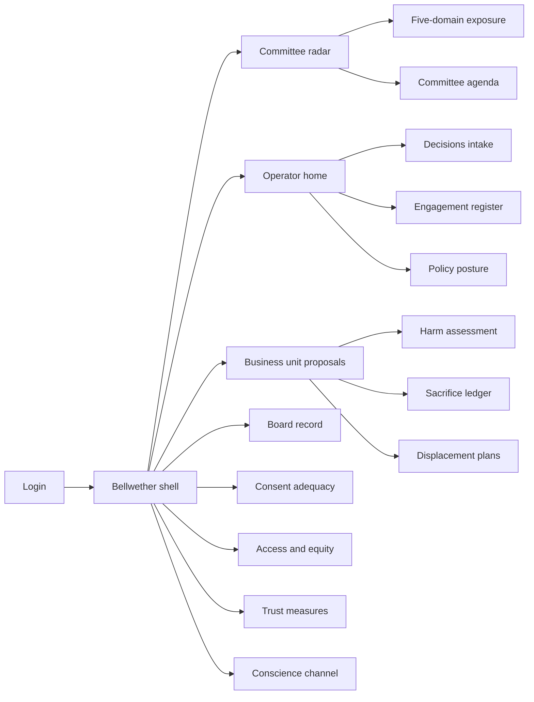
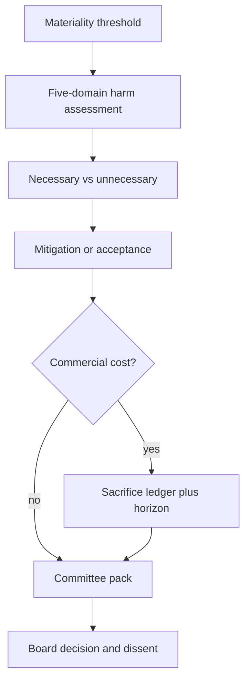

# Bellwether — Web app

**Product:** [PRODUCT.md](./PRODUCT.md)
**Primary surface:** Board technology-and-ethics committee radar (corporate affairs operators, committee chair, business-unit proposers, Company Secretary)
**Secondary surfaces:** Conscience-channel intake (compartmented); sacrifice horizon review pack; between-meetings delegated decision desk with ratification queue
**Design thesis:** Bellwether is a ship’s radar for technology *decisions* that land harm outside the firm — not a model clearance vault and not a sprint ethics gate. The metaphor is a five-spoke exposure radar over open water: each spoke is a named domain (commoditisation, consent, displacement, bias/inclusion, accessibility), and the centre holds the trade-off the board actually made — unnecessary harms mitigated or accepted, and the short-term sacrifice ledger with a horizon date. Visual language is deep maritime green-black with sodium-lamp amber for “between meetings / unratified,” and chalk-white for board-record paper. The UI never invents an “ethics score”; it forces whose-definition-of-harm onto the face of every assessment.

## UX research synthesis

### Category peers (best-in-class)

- **Diligent Boards / Nasdaq Boardvantage:** Agenda packs, immutable minutes, dissent capture, delegated authority with ratification. Steal: append-only board record, as-of reconstruction, and between-meetings decisions that must ratify; reject generic board-portal chrome that buries harm classification under PDF attachments.
- **LogicGate / Riskonnect-style continuous risk radar:** Living heat by domain and owner, movement not point-in-time scores. Steal: five-domain continuous exposure by stakeholder group; reject colour-only heatmaps without named mitigations/acceptances.
- **NAVEX EthicsPoint / Speak-Up portals:** Compartmented whistleblowing that bypasses implicated management. Steal: conscience-channel routing and reporter-protection evidence; reject conflating this with ordinary ticket queues visible to the accused line.
- **Workday / SuccessFactors change-impact + works-council workflows:** Displacement plans, consultation evidence, pre-approval gating. Steal: transition artefacts attached to the *decision* that causes them; reject HR-only silos that never reach the committee paper.

### Patterns to adopt / reject

- **Adopt:** Materiality threshold intake (capital / headcount / customers); necessary vs unnecessary harm as the primary classification; declared definition-of-harm basis; sacrifice ledger with horizon review; consent *comprehension* not checkbox capture; lead–match–trail policy posture; engagement “what changed” including no-change; conscience channel compartment; trust attributed to decisions.
- **Reject:** Single ethics score; Greylight-style stage gates as home; Attestra clearance seals; purple ESG glow; annual sustainability PDF as the operating surface; silent cross-jurisdiction harm definitions; card grids of vanity SDG icons.

### Trust, density, and workflow constraints from PRODUCT.md

Boards meet on a cycle; decisions do not — delegated authority + mandatory ratification or the product is bypassed (stories). Candid harm assessments may be discovery material — record alternatives considered, not conclusions alone (domain constraints). Conscience reports must never pass the accused reporting line (BR-12). Legal consultation duties cannot be replaced by surveys (BR-7). Self-set ethical positions must not look like legal clearance (domain constraints). Sacrifice ledger must survive leadership turnover (BR-5).

## Information architecture

### Nav model

### Roles → default home

| Role | Default home | Why |
|------|--------------|-----|
| Committee chair / NED | Committee radar + agenda | Trade-off approval (stories) |
| Corporate affairs operator | Operator home — movement & alerts | Weekly radar staffing (BR-4) |
| Business unit leader | Proposals — harms to design out | Early foresight (stories) |
| HR transition / employee rep | Displacement + consultation | Pre-approval gating (BR-7) |
| Privacy / consent lead | Consent adequacy | Comprehension evidence (BR-6) |
| Public policy lead | Policy posture lead–match–trail | Advocacy ownership (BR-10) |
| Company Secretary / audit | Board record as-of | Immutable reconstructability |
| Conscience intake | Conscience channel only | Compartmented routing (BR-12) |

### Cross-links to OpenAPI resources

| Nav area | OpenAPI tags / resources |
|----------|---------------------------|
| Decisions / materiality | Decisions |
| Harm itemisation | Harm Assessment |
| Continuous radar | Exposure |
| Sacrifice + horizon | Sacrifice Ledger |
| Comprehension / unconsented uses | Consent Adequacy |
| Transition plans | Displacement |
| Distributional commitments | Access & Equity |
| Lead–match–trail positions | Policy Posture |
| What heard / what changed | Engagement |
| Pressure reports | Conscience Channel |
| Per-group trust | Trust |
| Minutes, dissent, delegation | Board Record |

## Screen inventory

### Committee radar home

- **Purpose:** One composition answering “where is our exposure moving, and which decisions need a trade-off this cycle?”
- **Entry:** Default for committee chair; meeting deep link.
- **Layout regions:** Brand + committee context; five-spoke radar by stakeholder group; decisions ready for committee; unratified delegated decisions; sacrifice horizons due; conscience outcomes summary (counts only).
- **Primary actions:** Open decision pack; ratify/overturn delegated; open horizon review.
- **Empty / loading / error:** Empty radar = no material decisions in window with last refresh time; control-failure banner for proceeded-without-assessment.
- **BR / story ties:** BR-1, BR-4, BR-5; chair stories.

### Decision intake and materiality

- **Purpose:** Pull technology decisions into scope when capital, headcount, or customer thresholds fire.
- **Entry:** Operator / BU; capital-system signal.
- **Layout regions:** Threshold rule display; decision options/alternatives; status including `proceeded_without_assessment`; hold-on-capital cue.
- **Primary actions:** Register decision; contest materiality; escalate missing assessment.
- **Empty / loading / error:** Threshold breach without assessment = named-approver failure state.
- **BR / story ties:** BR-1.

### Harm assessment workspace

- **Purpose:** Per-domain harm itemisation with necessary/unnecessary classification and whose-definition basis.
- **Entry:** From decision; BU home.
- **Layout regions:** Five domain sections (one job each); harm items; classification with contest/adjudicate; definition-of-harm declaration; consulted groups; alternatives considered drawer.
- **Primary actions:** Add harm; classify; contest; assign mitigation; record acceptance.
- **Empty / loading / error:** Incomplete domains block “ready for committee.”
- **BR / story ties:** BR-2, BR-3.

### Exposure radar detail

- **Purpose:** Continuous scores across five domains × stakeholder groups with movement drivers.
- **Entry:** Radar home drill-down.
- **Layout regions:** Spoke chart; movement timeline; driver decisions; owner per domain slice.
- **Primary actions:** Brief pack export; pin driver; open related decisions.
- **Empty / loading / error:** Stale measurement = amber “position ageing.”
- **BR / story ties:** BR-4.

### Sacrifice ledger and horizon reviews

- **Purpose:** Quantify short-term commercial sacrifice, expected long-term benefit, and evidenced outcome at horizon.
- **Entry:** From mitigation cost; chair horizon queue.
- **Layout regions:** Ledger rows; horizon calendar; benefit evidenced / not; leadership-turnover durable notes.
- **Primary actions:** Record sacrifice; complete horizon review; report to committee.
- **Empty / loading / error:** Horizon due = sodium pulse; missing evidence = “intention only” flag.
- **BR / story ties:** BR-5.

### Consent adequacy

- **Purpose:** Measure whether people understood agreements; flag uses not covered by the original agreement.
- **Entry:** Consent nav; decision commoditisation/consent domains.
- **Layout regions:** Comprehension evidence by data use; unconsented-use register; decision required panel.
- **Primary actions:** Attach comprehension study; decide unconsented use; link policy posture.
- **Empty / loading / error:** Signed agreement without comprehension = inadequate, not green.
- **BR / story ties:** BR-6.

### Displacement and transition

- **Purpose:** Roles, non-linear retraining/redeployment, consultation evidence before board approval.
- **Entry:** When headcount impact flagged.
- **Layout regions:** Roles/locations (pre-announcement restricted); transition plan; works-council consultation; “what changed” after consultation; adoption-pace posture link.
- **Primary actions:** Attach plan; record consultation; employee-rep position; gate board approval.
- **Empty / loading / error:** Missing consultation = cannot mark ready for committee.
- **BR / story ties:** BR-7, BR-8 adjacency.

### Adoption pace posture

- **Purpose:** Incremental vs full-scale with oversight forgone, compensating oversight, and transparency commitments.
- **Entry:** Decision assess flow.
- **Layout regions:** Pace choice; reasoning; supervision forgone; compensating controls; commitments to employees/partners/customers.
- **Primary actions:** Record posture; publish transparency commitments.
- **Empty / loading / error:** Full-scale without compensating oversight = block.
- **BR / story ties:** BR-8.

### Access and equity commitments

- **Purpose:** Distributional effects on groups often left behind; corrective commitments with dates or reasoned refusal.
- **Entry:** Equity domain; Access nav.
- **Layout regions:** Benefit incidence; commitment list with delivery dates; reasoned non-commit; miss alerts.
- **Primary actions:** Make commitment; mark delivered; record reasoned no.
- **Empty / loading / error:** Disproportionate benefit with neither commitment nor reason = incomplete assessment.
- **BR / story ties:** BR-9.

### Policy posture board

- **Purpose:** Stated company position per domain with lead / match / trail vs emerging regulation and named advocate.
- **Entry:** Policy nav; chair “are we leading?” question.
- **Layout regions:** Five position plates; lead-match-trail badge; advocate owner; regulatory pipeline signals.
- **Primary actions:** Adopt/supersede position; reassess lead-lag; brief advocacy pack.
- **Empty / loading / error:** Missing position on a domain = exposed leadership gap.
- **BR / story ties:** BR-10.

### Engagement register

- **Purpose:** Multi-stakeholder engagements with what was heard and what changed — including no-change visibility.
- **Entry:** Operator home.
- **Layout regions:** Engagement list by stakeholder category; heard → changed mapping; no-change highlighted honestly.
- **Primary actions:** Log engagement; link decision change; mark no change.
- **Empty / loading / error:** Engagements without outcome field blocked from close.
- **BR / story ties:** BR-11.

### Conscience channel

- **Purpose:** Report commercial pressure overriding ethics on a named decision; route bypassing implicated line.
- **Entry:** Protected entry point; intake role only for contents.
- **Layout regions:** Intake form; compartment banner; routing status; outcome record; reporter-protection evidence; committee-facing summary without leaking identity improperly.
- **Primary actions:** Submit; route; record outcome; evidence protection.
- **Empty / loading / error:** Attempted access by implicated line = hard deny; empty = channel health with last drill.
- **BR / story ties:** BR-12; exception-path stories.

### Trust measurement

- **Purpose:** Per-group trust and comprehension on a cycle, attributed to decisions affecting that group.
- **Entry:** Trust nav; radar adjacency.
- **Layout regions:** Group indices; attribution to decisions; methodology note; demographic aggregate-only cue.
- **Primary actions:** Import wave; attribute; report beside decisions.
- **Empty / loading / error:** Ambient sentiment without attribution = insufficient for BR-13.
- **BR / story ties:** BR-13.

### Board record and delegation

- **Purpose:** Append-only decisions, positions, dissent, delegated authorities, ratifications — reconstructable as-of.
- **Entry:** Company Secretary default.
- **Layout regions:** Record timeline; as-of picker; dissent lane; delegation log; ratification queue.
- **Primary actions:** Seal meeting record; ratify; overturn; export for discovery-aware counsel.
- **Empty / loading / error:** Unratified past due = sodium failure on radar.
- **BR / story ties:** Secretary/audit stories; BR-1 control failures.

## Key flows

1. **Material decision to committee** — threshold fire → harm assessment across five domains → classify necessary/unnecessary → mitigate or accept → sacrifice if cost → ready pack → committee decision with dissent.

2. **Between-meetings delegation** — delegated authority used → sodium unratified state → next meeting ratify or overturn.

3. **Horizon review** — sacrifice matures → evidence benefit appeared or not → report to chair → position on future similar trade-offs.

4. **Conscience report** — employee submits → compartmented route → outcome recorded → protection evidenced → decision linkage without line visibility.

5. **Proceeded without assessment** — capital/release signal → control failure naming approver → committee alert while still correctable.

## Design system

### Tokens (CSS variables)

- `--color-ink: #E4EDE8` — primary text
- `--color-sea-950: #071410` — app ground
- `--color-sea-900: #0E221C` — panels
- `--color-sea-700: #1E3D34` — radar rings
- `--color-chalk: #F2F0E8` — board-record paper
- `--color-chalk-ink: #14201C` — text on chalk
- `--color-sodium: #E0A84A` — between-meetings / unratified
- `--color-spoke: #4A9B7F` — radar spoke (exposure)
- `--color-harm-unnecessary: #C45C4A` — unnecessary harm
- `--color-harm-necessary: #6B7C8A` — necessary (argued) harm
- `--color-lead: #3D8F6E` — leading posture
- `--color-trail: #B86B2E` — trailing posture
- `--font-display: "Literata", serif` — committee titles and sacrifice figures
- `--font-body: "Public Sans", sans-serif` — dense operator UI
- `--font-mono: "IBM Plex Mono", monospace` — decision ids, as-of stamps
- `--space-1`…`--space-8`: 4px scale
- `--radius-sm: 2px`; `--radius-md: 6px` — board-formal, not pill-heavy
- `--motion-radar: 400ms ease-in-out` — spoke refresh
- `--motion-sodium: 260ms ease-in-out` — unratified pulse
- `--motion-seal: 180ms ease-out` — board record seal
- Atmosphere: night harbour water with faint concentric radar rings; chalk paper only on board-record drawers; no stock handshake ESG photography.

### Typography & brand

- Literata for radar headlines and sacrifice ledger amounts; Public Sans for tables and assessments.
- Brand “Bellwether” as the strongest mark on committee surfaces; login hero: brand + one line (“Harm outside the firm, on the record”) + one CTA — no KPI tile strip.

### Do / don’t

- **Do:** Force whose-definition-of-harm; classify necessary vs unnecessary; show no-change engagements; compartment conscience; horizon-check sacrifices; keep legal clearance visually distinct from ethical position.
- **Don’t:** Ethics scores; purple glow; stage-gate delivery chrome; waiver of consultation via survey; editable board minutes; emoji “responsible” badges.

### Accessibility & domain trust cues

- Text + icon for lead/match/trail and harm classes; AA+ on sodium/spoke against sea.
- Live regions for proceeded-without-assessment, ratification due, conscience outcomes (role-scoped).
- Pre-announcement displacement views announce restricted access.
- Focus order: decision → harms → resolutions → board seal.

## Component patterns

- **FiveSpokeRadar** — domains × stakeholder groups with movement.
- **HarmClassToggle** — necessary / unnecessary with contest path.
- **DefinitionOfHarmBanner** — whose lens + consulted groups.
- **SacrificeLedgerRow** — cost, benefit, horizon, evidenced outcome.
- **LeadMatchTrailBadge** — policy posture vs regulation.
- **EngagementChangeMap** — heard → changed | no change.
- **ConscienceCompartment** — routing shell with line exclusion.
- **DelegatedSodiumState** — unratified between-meetings cue.
- **MaterialityThresholdChip** — capital / headcount / customers trigger.
- **AsOfBoardRecord** — reconstructable minutes and dissent.

## Out of scope for v1 web

- Model monitoring / MLOps; product-team sprint gates (Greylight); Art. 22 clearance plane (Attestra); public consumer trust portal; native mobile board apps beyond read packs; replacing Diligent/BoardEffect as minute systems of record (integrate).
